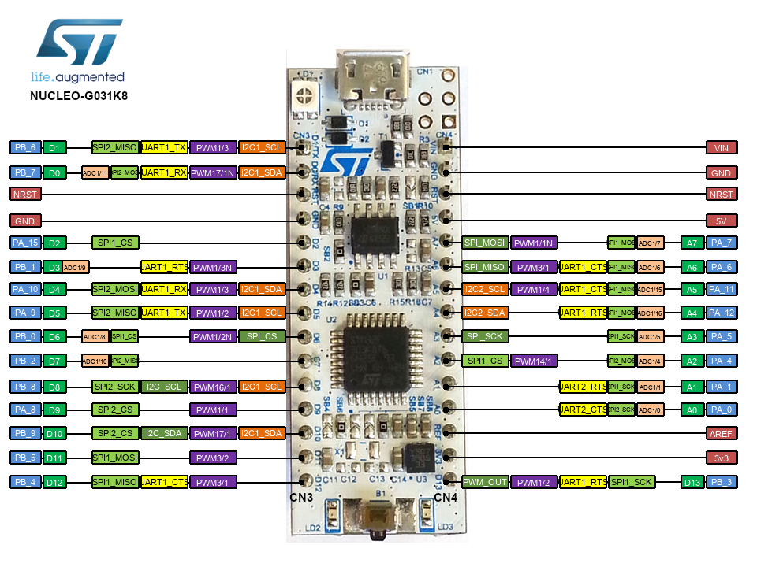

# GTU EEFC

Gebze Technical University - Electronic Engineering fcayci Lecture Documents. 
Examples for using Cortex-M0+ based stm32g0 processor. All the examples are made 
for Nucleo G031K8 board. Sample codes are created to start with number_xxx. Codes starting with 00_xxx are sample codes written by fcayci. The codes that start as 01_xxx and continue to increase are project files written by me for specific purposes. Stm32g0 proccessor's pinouts and all the alternative functionality of 
the board is given in the figure below.

## STM32G0

The board comes with ST-Link programmer / debugger so no need for an extra 
hardware.

## Setup

The projects are set up to be used with STM32CubeIDE.

1. Set your workspace as the root directory of the project
2. Import existing projects to the workspace. (no need to copy)

There is also makefiles if you want to roll your own development environment 
using command line.

## Documents

1. STM32G031K8 [Datasheet](https://www.st.com/resource/en/datasheet/stm32g031k8.pdf) [Errata](https://www.st.com/resource/en/errata_sheet/dm00625293-stm32g031x4x6x8-device-errata-stmicroelectronics.pdf)
1. [RM0444](https://www.st.com/resource/en/reference_manual/dm00371828-stm32g0x1-advanced-armbased-32bit-mcus-stmicroelectronics.pdf) - Reference Manual for STM32G0x1 Devices
1. [PM0223](https://www.st.com/resource/en/programming_manual/dm00104451-cortexm0-programming-manual-for-stm32l0-stm32g0-stm32wl-and-stm32wb-series-stmicroelectronics.pdf) - Programming Manual for STM32G0
1. [Cortex-M0+ Devices Generic User Guide](https://developer.arm.com/documentation/dui0662/b)
1. [Cortex-M0+ Technical Reference Manual](https://developer.arm.com/documentation/ddi0484/c)
1. Nucleo-G031K8 [Schematic](https://www.st.com/resource/en/schematic_pack/mb1455-g031k8-c01_schematic.pdf) 

Thanks for fcayci...<3

